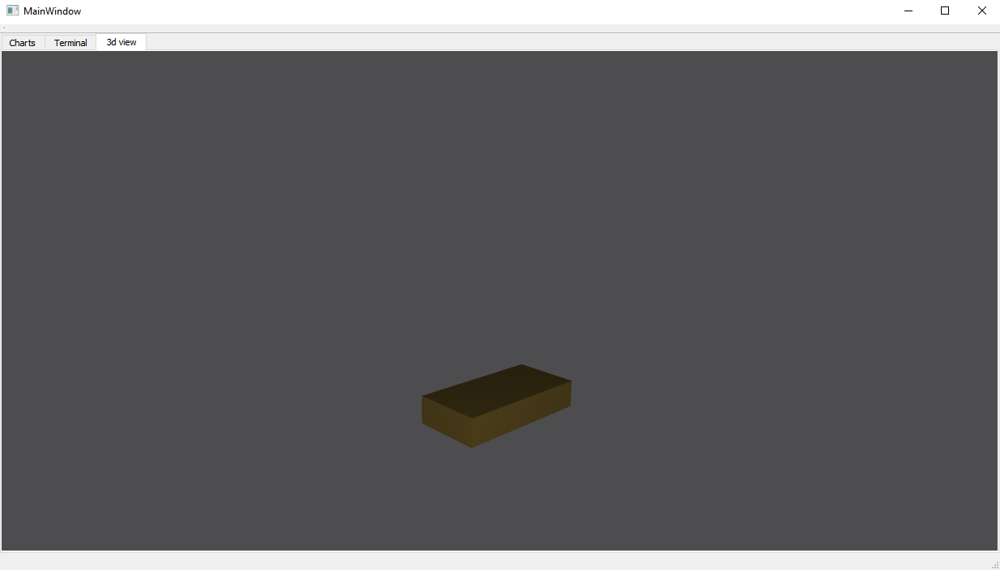
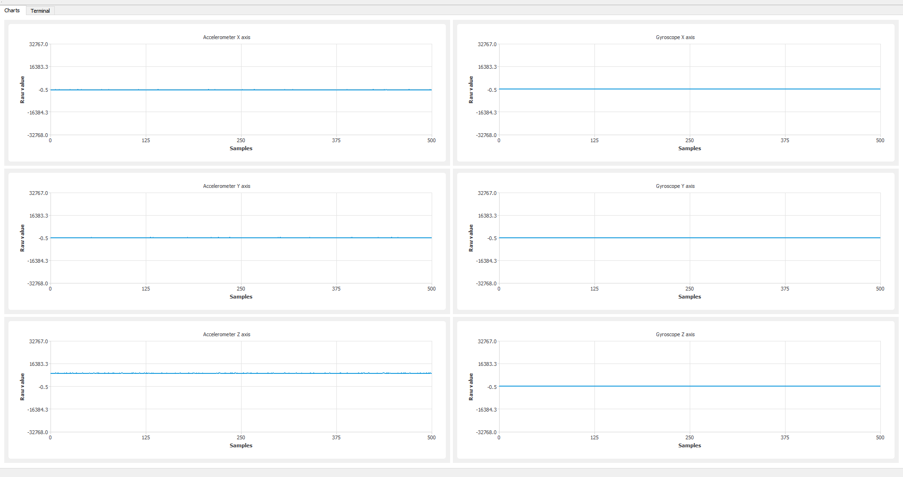

## Kontroler 6DoF
### Opis projektu
Projekt składa się z dwóch części: kontrolera bezprzewodowego wraz z odbiornikiem
oraz aplikacji komunikującej się z kontrolerem.
To repozytorium zawiera część z aplikacją desktopowaą

### Aplikacja
Aplikacja odbiera dane wysyłane przez kontrole i pozwala na wizualizację jego orientacji. Aplikacja zostałą napisana w języku C++ z wykorzystaniem bibliotek Qt.

## Wygląd aplikacji:
### Widok wizualizacji:

### Widok odbieranych danych w postaci wykresów

